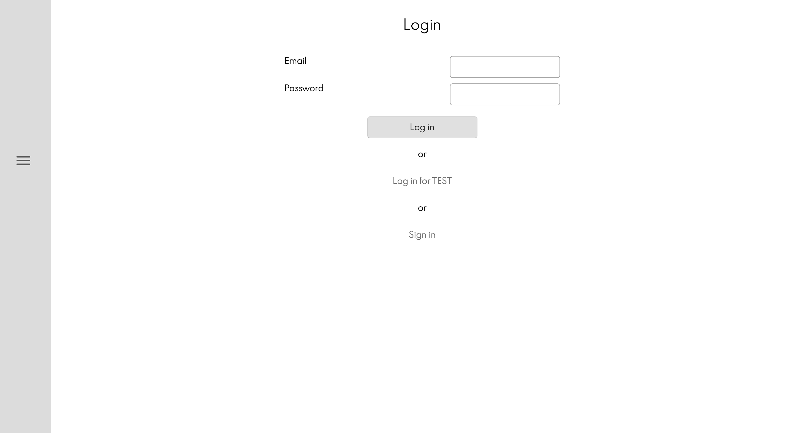
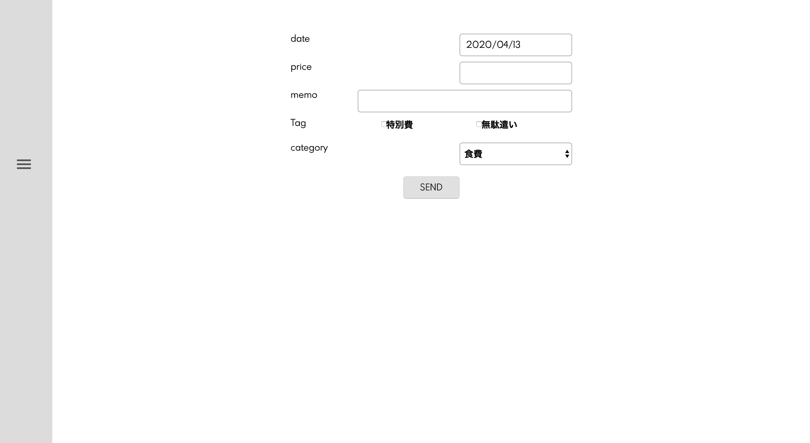
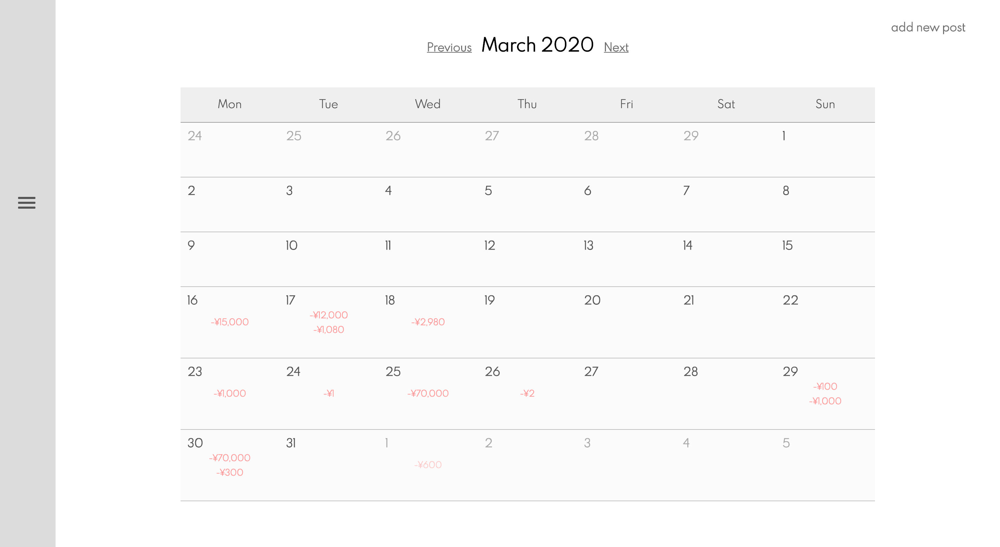
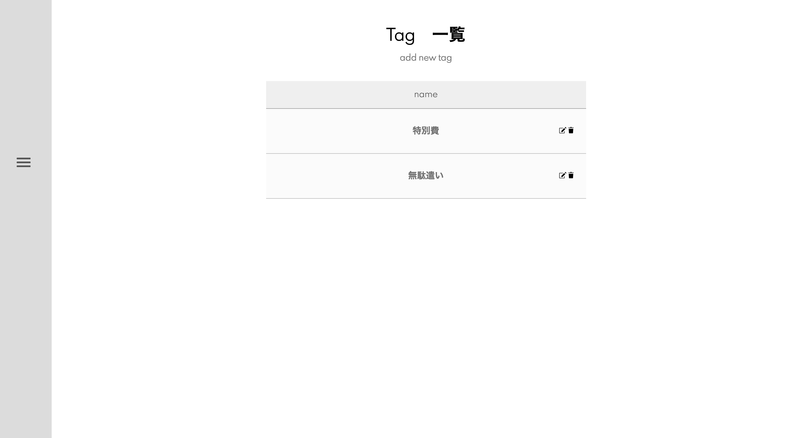
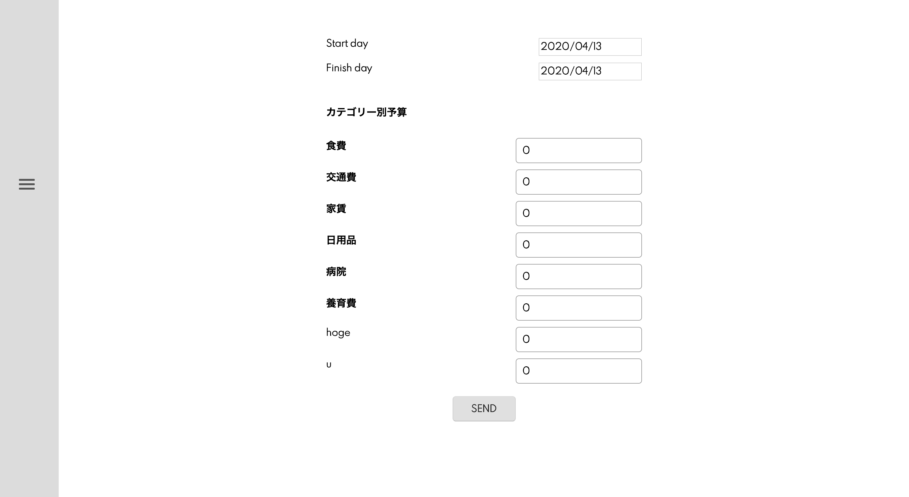
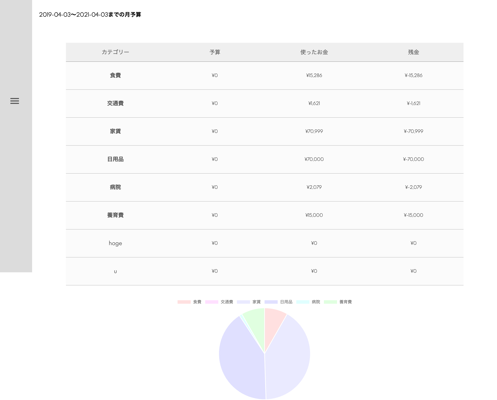

# はじめに
ご覧いただきましてありがとうございます。
本アプリは、「自由度の高い家計簿」をテーマにした家計簿アプリです。

1. [機能とデモ画像](#機能とデモ画像)
2. [開発環境](#開発環境)
3. [インストール](#インストール)
4. [製作者](#製作者)
5. [データベース設計](#データベース設計)


# 機能とデモ画像
- ユーザー登録、ログイン、簡単ログイン
  - 「Login for TEST」をクリックすると、テスト用アカウントでログインできます。
  

- 家計簿の投稿
  

- 支出項目(カテゴリー)の作成
  

- 支出金額をカレンダー上で表示
  

- タグ付け
  - カテゴリーの他にタグ付けで支出を管理することもできます。
  - (無駄遣いや、特別費の管理等)
  

- 予算の作成
  

- 集計機能
  - 立てた予算に対して使用した金額をカテゴリー別に集計
  - 円グラフで支出の割合を表示
  


# 開発環境
- HTML
- CSS
- Ruby
- Ruby on Rails
- Javascript(JQuery)
- MySQL
- AWS


# インストール
```
$ git clone https://github.com/rie1224/account.git
$ cd account
```


# 製作者
[Rie Yoshida/Twitter](https://twitter.com/riebo24)


# データベース設計

## budgetsテーブル
|Column|Type|Options|
|------|----|-------|
|price|integer|null: false|
|user_id|reference|null: false, foreign_key: true|
|monthly_id|reference|null: false, foreign_key: true|
|category_id|reference|null: false, foreign_key: true|
### Association
- belongs_to :users
- belongs_to :monthlies
- belongs_to :categories


## categoriesテーブル
|Column|Type|Options|
|------|----|-------|
|name|string|null: false|
### Association
- has_many :posts
- belongs_to :users


## monthliesテーブル
|Column|Type|Options|
|------|----|-------|
|start_at|datetime|null: false|
|finish_at|datetime|null: false|
|user_id|reference|null: false, foreign_key: true|
### Association
- belogs_to :users


## postsテーブル
|Column|Type|Options|
|------|----|-------|
|p_price|integer|null: false|
|memo|string||
|date|datetime|null: false|
|user_id|reference|null: false, foreign_key: true|
|category_id|reference|null: false, foreign_key: true|
### Association
- has_many :tags, through: :posts_tags
- has_many :posts_tags
- belongs_to :category


## tagsテーブル
|Column|Type|Options|
|------|----|-------|
|name|string|null: false|
### Association
- has_many :posts, though: :posts_tags
- has_many :posts_tags


## posts_tagsテーブル
|Column|Type|Options|
|------|----|-------|
|post_id|reference|null: false, foreign_key: true|
|tag_id|reference|null: false, foreign_key: true|
### Association
- belongs_to :posts
- belongs_to :tags

# usersテーブル
|Column|Type|Options|
|------|----|-------|
|name|string|null: false|
|e-mail|string|null: false|
### Association
- has_many :budgets
- has_many :categories
- has_many :monthlies
- has_many :posts
- has_many :tags


